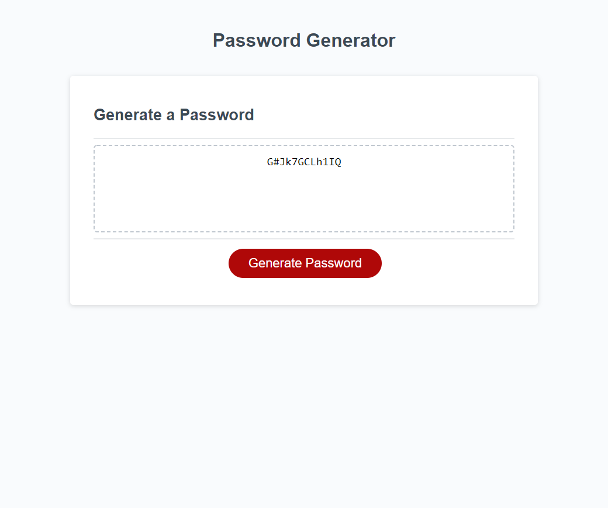

# Password Generator

This app will let you generate a randomized password depending on the user's selected criteria. Click the "Generate Password" button and select your password criteria from the four available propmts. You have the option to include lowercase characters, UPPERCASE characters, numbers, and special characters in your password with any length you desire (between 8 and 128 characters).

NOTE: If you don't like the randomly generated password it gives you, keep generating new random passwords until you get the security you are looking for!

## Features

+ add lowercase letters, uppercase letters, numbers, and/or special characters
+ make passwords up to 128 characters long
+ generate a great pseudo-random password
+ use it as many times as you'd like

## Screenshot and Link

[Link To Project on GitHub Pages](https://damienluzzo33.github.io/password-generator-js/)

## Other

+ Some of this project was done alongside Cole Cochran and Christopher Kennard
+ Completed this project with the least amount of code possible